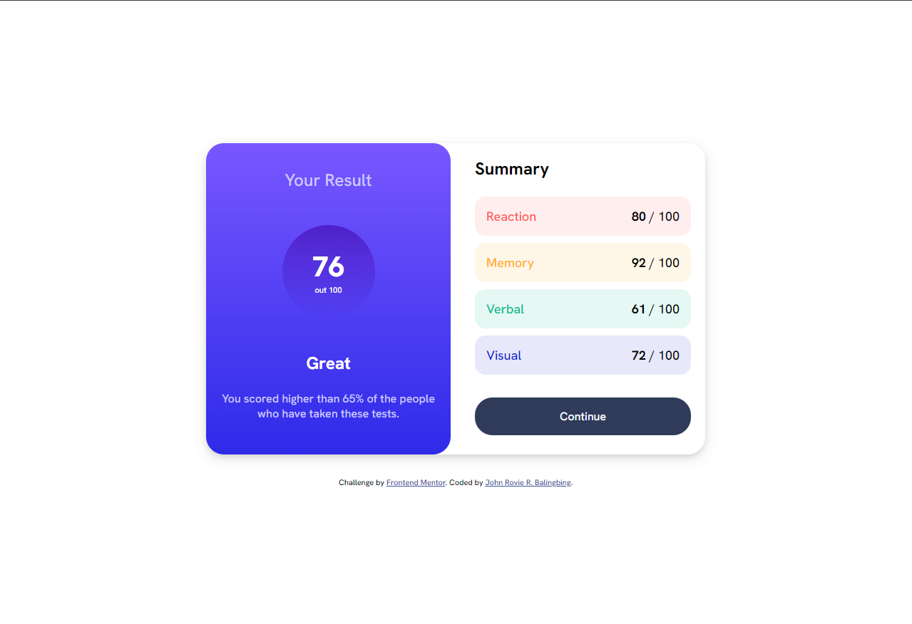

# Frontend Mentor - Results summary component solution

This is a solution to the [Results summary component challenge on Frontend Mentor](https://www.frontendmentor.io/challenges/results-summary-component-CE_K6s0maV). Frontend Mentor challenges help you improve your coding skills by building realistic projects. 

## Table of contents

- [Frontend Mentor - Results summary component solution](#frontend-mentor---results-summary-component-solution)
  - [Table of contents](#table-of-contents)
  - [Overview](#overview)
    - [The challenge](#the-challenge)
    - [Screenshot](#screenshot)
    - [Links](#links)
  - [My process](#my-process)
    - [Built with](#built-with)
    - [Highlights of the code](#highlights-of-the-code)
  - [Author](#author)

## Overview

### The challenge

Users should be able to:

- View the optimal layout for the interface depending on their device's screen size
- See hover and focus states for all interactive elements on the page

### Screenshot



### Links

- Solution URL: [https://github.com/rovicbalingbing/result-summary-frontendMentor.git](https://github.com/rovicbalingbing/result-summary-frontendMentor.git)
- Live Site URL: [https://rovicbalingbing.github.io/result-summary-frontendMentor/](https://rovicbalingbing.github.io/result-summary-frontendMentor/)

## My process

### Built with

- Semantic HTML5 markup
- CSS custom properties
- Flexbox
- CSS Grid
- Media Queries


### Highlights of the code

```html
<div class="leftDiv">
  <div class="result-holder">
    <h4 class="title">Your Result</h4>
    <div class="cicrle">
      <h1 class="result">76</h1>
      <h5 class="base-result">out 100</h5>
    </div>
    <h3 class="message">Great</h3>
    <p class="message-info">You scored higher than 65% of the people who have taken these tests.</p>
  </div>
</div>
```
```css
:root {
  /* PRIMARY COLORS */
  --light-red: hsl(0, 100%, 67%);
  --light-red-bg: hsla(0, 100%, 67%, 0.1);
  --orange-yellow:hsl(39, 100%, 56%);
  --orange-yellow-bg:hsla(39, 100%, 56%, 0.1);
  --green-teal: hsl(166, 100%, 37%);
  --green-teal-bg: hsla(166, 100%, 37%, 0.1);
  --cobalt-blue: hsl(234, 85%, 45%);
  --cobalt-blue-bg: hsla(234, 85%, 45%, 0.1);

  /* FOR GRADIENT */
  --light-slate-blue: hsl(252, 100%, 67%);
  --light-royal-blue: hsl(241, 81%, 54%);
  --violet-blue: hsla(256, 72%, 46%, 1);
  --persian-blue: hsla(241, 72%, 46%, 0);

  /* NEUTRAL COLORS */
  --white: hsl(0, 0%, 100%);
  --pale-blue: hsl(221, 100%, 96%);
  --light-lavender: hsl(241, 100%, 89%);
  --dark-gray-blue: hsl(224, 30%, 27%);
}
```

## Author

- Website - [John Rovie R. Balingbing](https://github.com/rovicbalingbing)
- Frontend Mentor - [@rovicbalingbing](https://www.frontendmentor.io/profile/rovicbalingbing)
- Twitter - [@roscidDreaming](https://www.twitter.com/roscidDreaming)